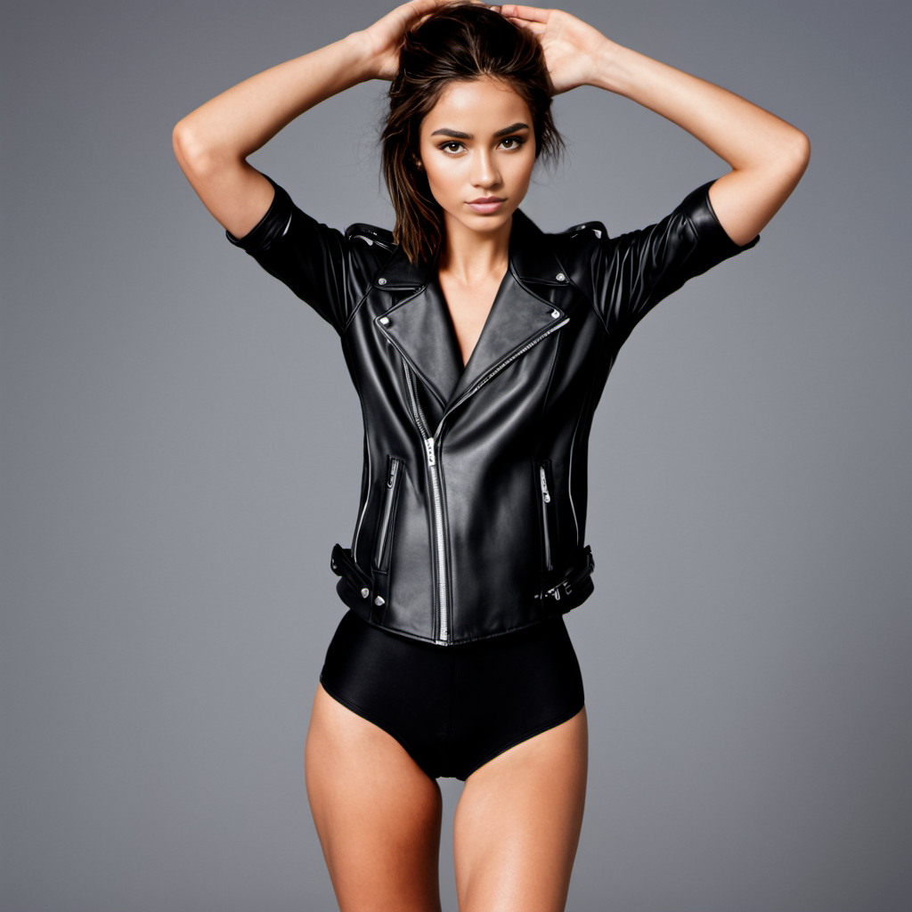
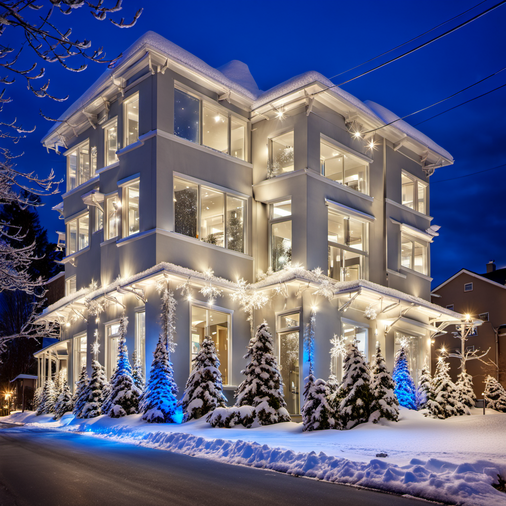

## Cars cutout with generated shadows and reflections

#### Project description
The project considers unification of a set of car photos getting consistent look at the website.
#### Workflow
* Cut the car from an image
* Place the car to a background image
* Generate reflection and shadows maps
* Merge all

#### Input data: photos of car, background images

*Background:*

*Cars:*

#### Result
The main point of the project is to get organic view which is unreachable without shadows and reflections

## Painting panoramas to photos (Vilnius City 18th century)

#### Project description
A project for a TV historical series. The task was to recreate paintings of ancient Vilnius panoramas as photos. 
 
*Input 1:*

*Output 1:*

*Input 2: *

*Output 2:*

*Input 3:*

*Output 3:*

## HeadShot App - Photo Enhancer

#### Project description
A workflow for the headshot app which considers utilization of InstantID and IPAdapter for SDXL aiming to nhance users photographs.
#### Workflow
* Take users photo
* Extract facial embedding with InstantID
* Extract haircut embedding with IPAdapter
* Properly masking
* Generate a person with the background regarding textual prompts 
 
*Input:*

*Workfl (prototyping in ComfyUI):*

Output:

## Game components generation with depth maps
#### Project description
The goal of the project is to setup the workflow which allows to generate images and masks for the images for a game where it is necessary to keep one style and fit cells using depth maps of objects. 
*For example: we have a depth map of a cell for factory (the image below): 

#### Workflow
I used ComfyUI to arrange all the nodes and eventually get proper generation of the images and its mask. ![[Upwork/_pics/wf_1.png]]

#### Result
Finally I got the workflow which can generate infinite number of stylized masked images for a cell map of the game in high resolution.

## Consistent character 

### Project description
The most usable case for generative AI is characters generation. I worked much with the case and made some consistent characters known as "AI influencers" which is a huge trend in 2023/2024.
This projects considers:
* Train LORA model for a character
* Add pose control for the person
* Perform different facial expressions
* Utilize outfit application for the person basing on outfit image

### Input data

*Pose reference image: **pose_1***

*Pose reference image: **pose_2***

*Face reference image: **face_1***

*Outfit reference image: **outfit_1***

*Outfit reference image: **outfit_2***

#### Result

*pose_1 + face_1 + outfit_1*:

*pose_1 + face_1 + outfit_2 + smiling:*

*pose_2 + face_1 + outfit_1*:

## Outdoor photo generation basing on a sketch and applying styles

#### Project description
Imagine, you have only a sketch of an outdoor location. You need to generate a photo of the building according the sketch and apply different style (e.g. spanish, contemporary, tropical, etc.).

*The sample of sketch:

#### Result

*Christmas style*

*Spanish style*

*Tropical style*

*Contemporary style*

## Interior style change generation by one one photo

####  Project description
This is the work regarding interior style generation. Imagine, you have a photo (or a render) of an interior and it is necessary to change a style of the interior leaving fundamental parts. 

*The image of the base interior*

*Balinese style*

*Contemporary style*

*Christmas style*

*Victorian style*

*Space style*
